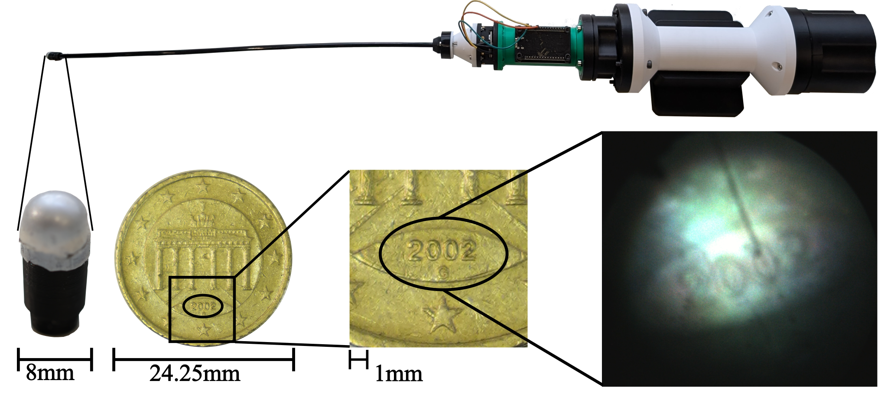

# MISTac  

[](LICENSE)

<div style="max-width: 850px; margin: 0 auto; text-align: center;">

  <a href="https://arxiv.org/abs/2608.14772">
    <strong>MISTac: A Vision-Based Tactile Sensor for Minimally Invasive Surgery</strong>
  </a>
  <br>
  <em>Robin Koch, Anabella Mascot, Rayan Younis,<br>  Martin Wagner, Stefanie Speidel, Marc Cutkosky, Ingo Sieber, and Roberto Calandra</em>



  <div style="text-align: left; margin-top: 1rem;">
    MISTac is a vision-based tactile sensor designed for use during minimally invasive surgery (MIS). It features a replaceable 8mm sensor tip that is compatible with the trocars used in MIS.
    A fiber optic bundle allows the use of bulky off-the-shelf components at the proximal end of the sensor. The sensor housing is fully modular for easy repairs and upgrades.
  </div>

</div>

## Content
This repository contains the CAD files and BOM for manufacturing the proximal and distal end of the MISTac vision-based tactile sensor, as well as the code used to set its illumination. <br> 
**Full build guide coming soon.**


## Citing
If you use this project in your research, please cite this [paper](https://arxiv.org/abs/2608.14772):
```
@misc{koch2026mistac,
      title={MISTac: A Vision-Based Tactile Sensor for Minimally Invasive Surgery}, 
      author={Robin Koch and Annabella Mascot and Rayan Younis and Martin Wagner and Stefanie Speidel and Mark Cutkosky and Ingo Sieber and Roberto Calandra},
      year={2026},
      eprint={2608.14772},
      archivePrefix={arXiv},
      primaryClass={cs.RO},
      url={https://arxiv.org/abs/2608.14772}, 
}
```
## License
These design files are licensed under CC-by-NC-SA, as found in the [LICENSE](LICENSE) file.


